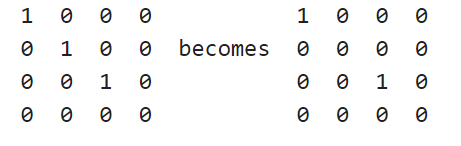

## Mitochondria Skeleton Length Calculator (Matlab)

This program is developed by [Tim Fan](https://github.com/Anominious).
You can download the .m file [here](https://www.mathworks.com/matlabcentral/fileexchange/101579-mitochondria-s-skeleton-length-and-aspect-ratio-calculator) and install it as an app to access the function.

### The Terms

#### - Bounding Box

A bounding box of a section is decided by its largest and smallest values in x, y, and z direction. The length, width, and height of a bounding box can be obtained by doing subtractions bewteen each pair of x, y, and z values. 

Here is an example of a bounding box in the total volume:


#### - Aspect Ratio

The [aspect ratio](https://en.wikipedia.org/wiki/Aspect_ratio) the ratio between the length and width of a shape. Since the bounding box of a section is a rectangular prism, this project takes 3 aspect ratio of each section: xy, xz, yz. 


#### - Skeleton

The skeleton of sections is obtained using the [skeleton3d](https://www.mathworks.com/matlabcentral/fileexchange/43400-skeleton3d) function. The process of "skeletonization" is also known as the [Medial Axis Transform](https://homepages.inf.ed.ac.uk/rbf/HIPR2/skeleton.htm). Detailed examples of 3d skeletonization can be found [here](https://www.mathworks.com/help/images/ref/bwmorph3.html), an alternative to skeleton3d. However, neither of these two functions calculates the length of the generated skeletons. Therefore, calculating  the length of skeletons became the goal for this program.

#### - Connectivity 
In order to calculate the length of the generated skeleton, this program calculate the distance between each adjacent voxel and add them up. In a 3d space, one [voxel](https://en.wikipedia.org/wiki/Voxel) can have 26 distinct adjacent voxels surrounding it. These 26 can be classified to 3 categories: connected via surface, via edge, and via point. The 3 categories each have different method to obtain the distance between the two voxels. 

Connected surface (6 total, devided to 3 kinds):


Connected edge (12 total, devided to 3 kinds):


Connected point (8 total):


### The Codes
#### - How to use

The function takes 7 inputs: mito_meta_file_name, pixel_length, pixel_width, page_thickness, shrinked_ratio, sample_name, and full__h5_directory. Since the h5 file is exported as 2048/2048pixels resolution, the resolution can be different from the original image volume. The "shrinked_ratio" is simply origianl image volume length/2048. The rest of the inputs are pretty self explanitory. An example would be: 
```matlab
mito_skel_length_aspect_ratio_calculator('mouse_mito_meta',16,16,40,2,'mouse','C:\mito_project\mouse_h5_folder\mouse_mito_16nm.h5')
```

#### - Getting Started 

First, access the cvs file and extract index and bounding box coordinates, and convert them to 2 arrays.
```matlab
mito_meta = readtable(mito_meta_file_name);
mito_index = table2array(mito_meta(:,1));
bbox_array = table2array(mito_meta(:,19:24));
```
Next, remove the categorical parent sections, which only serve as folders for other sections and are not actually drawn. The bounding box values for these sections are all -1.
```matlab
probelm = [-1 -1 -1 -1 -1 -1];
while ismember(probelm,bbox_array,'rows') == 1
    rowindex = find(ismember(bbox_array,probelm,'rows')>0);
    bbox_array(rowindex(1),:)=[];
    mito_index(rowindex(1),:)=[];
end
```
Also calculate the potential distancse in nanometers between two adjacent voxels, based on pixel length, pixel width, page thickness, and connectivity. 
```matlab
voxel_length = pixel_length*shrinked_ratio; 
voxel_width = pixel_width*shrinked_ratio; 
voxel_height = page_thickness; 
edge_dist_a = sqrt(voxel_length^2+voxel_width^2);
edge_dist_b = sqrt(voxel_length^2+voxel_height^2);
edge_dist_c = sqrt(voxel_width^2+voxel_height^2);
point_dist = sqrt(voxel_length^2+voxel_width^2+voxel_height^2);
```

#### - Aspect Ratio 

##### Calculation Function:

Each ratio is calculated with the larger value devided by the smaller value. 
```matlab
  function d = get_ratio(a,b)
        if a>b
            d = a/b;
        else
            d = b/a;
        end
    end
```

##### Getting Aspect Ratios
This program calculates the aspect ratios of the bounding boxes and not the mitochondria themselves. And the lengths, widths, and heights of the bounding boxes can be mathmetically calculated with the data provided by `mito_meta`. 

Since the bounding box's side lengths are number of pixels, to calculate the true ratio of each mitochondria, the x length needed to be multiplied with `pixel_length`, as the y length with `pixel_width` and z length with `page_thickness`. After the calculation of each bounding box, the 3 aspect ratios are appended to an array as a vector. 
 
```matlab
x_true_dist = (bbox_array(index,4)-bbox_array(index,1))*pixel_length;
y_true_dist = (bbox_array(index,5)-bbox_array(index,2))*pixel_width;
z_true_dist = (bbox_array(index,6)-bbox_array(index,3))*page_thickness;
xy_ar = get_ratio(x_true_dist,y_true_dist);
xz_ar = get_ratio(x_true_dist,z_true_dist);
yz_ar = get_ratio(y_true_dist,z_true_dist);
aspect_ratios = [aspect_ratios;
                  [mito_index(index) xy_ar xz_ar yz_ar]];
```

#### - Skeleton Length

##### Extracting the Boundary Box and Generating the Skeleton
Reading the full h5 file is way too much work. Therefore, for each mitochondrion, this program only read the part of the h5 defined by the mitochondrion's bounding box. Also due to the sheer sizes of h5 files, the image stacks are shrinked from their origin dimentions to (2048 pixel x 2048 pixel x original page number). Therefore, to find the start and distance in the h5 files, this program needs to devide the data from `mito_meta` with the `shrinked ratio`, or else the `h5read()` would have exceed limit errors. Since the h5 files are generated with a python program, whose index starts with 0, this program, a matlab program, whose index starts with 1, need to +1 to the values to eliminate 0 values.

The approximate bounding box, which is a 3d array, needs to be binarized according to the greyscale index of the mitochondrion in each loop, since skeletonization can only be used in binarized arrays/images. Afterwards, the skeleton of the mitochondrion can be generated with just a single line of code. 

```matlab
x_start = floor(bbox_array(index,1)/shrinked_ratio)+1;
y_start = floor(bbox_array(index,2)/shrinked_ratio)+1;
z_start = bbox_array(index,3)+1;
x_distance = floor((bbox_array(index,4)-bbox_array(index,1))/shrinked_ratio)+1;
y_distance = floor((bbox_array(index,5)-bbox_array(index,2))/shrinked_ratio)+1;
z_distance = bbox_array(index,6)-bbox_array(index,3)+1;
start = [x_start y_start z_start];
count =[x_distance y_distance z_distance];
bbox = h5read(full__h5_directory,'/images',start,count);
%binarize the content within boundary box, removing all content other than the selected mito, according to grey value
bi_bbox = bbox == mito_index(index);
%make the skeleton of the mito
skel = Skeleton3D(bi_bbox);
```

##### Slicing Branches 
As mentioned before, the length of a skeleton is calculated by adding the distances between each adjacent voxels. However, how does the program determine where to start, and when to stop? Fortunately, in the [bwmorph3](https://www.mathworks.com/help/images/ref/bwmorph3.html) function, there are 2 concepts that are very helpful: branch points, and end points. Essencially, branch poitns are voxels that have 3 or more adjacent voxels who are also in the skeleton, and end points are voxels that only have 1 adjacent voxel that is in the skeleton. Here are examples of branch points and end points in 2d from [bwmorph](https://www.mathworks.com/help/images/ref/bwmorph.html?searchHighlight=bwmorph&s_tid=srchtitle_bwmorph_1):

Branch Point:


End Point:



First, the program finds the coordinates of all the branch points, and change the 1s in those coordinates into 0s. This removes the points from the skeleton, which is now sliced into branches. 
```matlab
%find branch points and their coordinates
Bpoints = bwmorph3(skel,'branchpoints');
Bpoints_c = [];
[row, col, page] = findND(Bpoints == 1);
for i = length(row)
    Bpoints_c = [Bpoints_c; [row, col, page]];
end
%slicing branches
branches = skel - Bpoints;
```

Then, find the coordinates of endpoints of every branch and append them in an array as vectors. 
```mtalab
Epoints = bwmorph3(branches,'endpoints');
Epoints_c = [];
[row, col, page] = findND(Epoints == 1);
for i = length(row)
    Epoints_c = [Epoints_c; [row, col, page]];
end
```

Since each branch has 2 end points, the length of `Epoints_c` is always even, and the coordinates in it can always be paired up. 

Last but not least, find the coordinates of all points in all branches
```matlab
skel_c = [];
[row, col, page] = findND(branches == 1);
for i = length(row)
    skel_c = [skel_c; [row, col, page]];
end
```

Now that the program have all the necessary component, it can start the calculation of the length of the skeleton!

##### Skeleton Length Calculation

The program starts the calculation at the first end point in `endpoint_c`, registering the point as `start_point` and removing its coordinate from both arrays of coordinates: `skel_c` and `Epoint_c`, to avoid repetition . 
```matlab
start_point = Epoints_c(1,:);
skel_c(find(ismember(skel_c, start_point,'rows')),:) = [];
Epoints_c(find(ismember(Epoints_c, start_point,'rows')),:) = [];
```

Then, the program finds the coordinate of every voxel surrounding `start_point`. When I wrote the code, I separted p1~p26 by layers.
```matlab
p1 = [start_point(1)-1, start_point(2)-1, start_point(3)-1];
p2 = [start_point(1), start_point(2)-1, start_point(3)-1];
p3 = [start_point(1)+1, start_point(2)-1, start_point(3)-1];
p4 = [start_point(1)-1, start_point(2), start_point(3)-1];
p5 = [start_point(1), start_point(2), start_point(3)-1];
p6 = [start_point(1)+1, start_point(2), start_point(3)-1];
p7 = [start_point(1)-1, start_point(2)+1, start_point(3)-1];
p8 = [start_point(1), start_point(2)+1, start_point(3)-1];
p9 = [start_point(1)+1, start_point(2)+1, start_point(3)-1];

p10 = [start_point(1)-1, start_point(2)-1, start_point(3)];
p11 = [start_point(1), start_point(2)-1, start_point(3)];
p12 = [start_point(1)+1, start_point(2)-1, start_point(3)];
p13 = [start_point(1)-1, start_point(2), start_point(3)];
p14 = [start_point(1)+1, start_point(2), start_point(3)];
p15 = [start_point(1)-1, start_point(2)+1, start_point(3)];
p16 = [start_point(1), start_point(2)+1, start_point(3)];
p17 = [start_point(1)+1, start_point(2)+1, start_point(3)];

p18 = [start_point(1)-1, start_point(2)-1, start_point(3)+1];
p19 = [start_point(1), start_point(2)-1, start_point(3)+1];
p20 = [start_point(1)+1, start_point(2)-1, start_point(3)+1];
p21 = [start_point(1)-1, start_point(2), start_point(3)+1];
p22 = [start_point(1), start_point(2), start_point(3)+1];
p23 = [start_point(1)+1, start_point(2), start_point(3)+1];
p24 = [start_point(1)-1, start_point(2)+1, start_point(3)+1];
p25 = [start_point(1), start_point(2)+1, start_point(3)+1];
p26 = [start_point(1)+1, start_point(2)+1, start_point(3)+1];
```
Then, the program checks whether any of these coordinates are in `skel_c`, which would imply the voxel being on the skeleton. Since `start_point` is an end point, there should only be 1 adjacent voxel for `start_point`. After finding the adjacent voxel, the program adds a certain distance to the float `total_distance`, based on the connectivity between the adjacent voxel and `start_point`. Then the coordinate this adjacent voxel is removed from `skel_c` to avoid repetition. Then `start_point` is redefined by the coordinates of this adjacent voxel, and start over the loop of calculation. 

If the coordinate of this adjacent voxel is in `Epoint_c`, which would imply the end of a branch, the program would end the current while loop, and continue down the list of `Epoint_c`, until the array is empty. At which point, all the branches would be calculated, and the total length of the skeleton would be a float `total_distance`. 

The order in which the program checks each of the 26 adjacent voxels is from the closest category of connectivity to the longest category of connectivity: surface, edge, and then point. Since the full code is too long, here is an example code for `p5`, a voxel connected to `start_point` through a surface. The rest of the possibilities are written with `elseif` statements.  
```matlab
if ismember(p5,skel_c,'rows') == 1
    total_length = total_length+voxel_height;
    skel_c(find(ismember(skel_c, p5,'rows')),:) = [];
    if ismember(p5,Epoints_c,'rows') == 1
        Epoints_c(find(ismember(Epoints_c, p5,'rows')),:) = [];
        anymore = 0;
    end
    start_point = p5;
```

After the distance of every pair of adjacent voxels in every branch is added to `total_distance`, it is appended to `all_skel_lengths`, and then reset to 0. 

#### Output 

The aspect ratio and skeleton length of every mitochondrion are now in 2 arrays. Now it is time to combine them and output a .csv file, which is the final step of this program. 

```matlab
aspect_ratios(:,5) = all_skel_lengths(:,2);
header = {'index','xy_ratio','xz_ratio','yz_ratio','skel_length'};
output = [header; num2cell(aspect_ratios)];
final_data = cell2table(output(2:end,:),'VariableNames',output(1,:));
file_name = append(sample_name,'_mito_aspect_ratios_skel_length.csv');
writetable(final_data,file_name);
```
